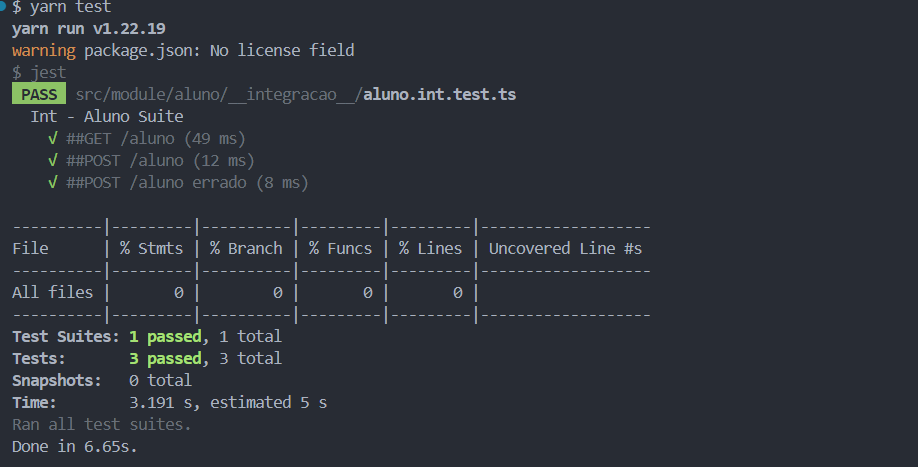

# Projeto de API Backend em TypeScript



---

## Descrição

Este projeto é uma API backend desenvolvida em TypeScript com o objetivo de demonstrar a implementação de testes de integração utilizando o framework de testes Jest.


# Indice

- [Projeto de API Backend em TypeScript](#projeto-de-api-backend-em-typescript)
  - [Descrição](#descrição)
- [Indice](#indice)
  - [📑 Sobre](#-sobre)
  - [🚀 Tecnologias utilizadas](#-tecnologias-utilizadas)
  - [📁 Como baixar o projeto](#-como-baixar-o-projeto)
  - [Funcionalidades](#funcionalidades)
  - [Pré-requisitos](#pré-requisitos)
  - [Executando a Aplicação](#executando-a-aplicação)
  - [Testes](#testes)
  - [Estrutura do Projeto](#estrutura-do-projeto)
  - [Licença](#licença)

---

## 📑 Sobre

Neste projeto foi feito a migração de javascript para typescript para melhorar a segurança e controle de testes utilizando o framework "Jest" para os testes de integração nos endpoints, cobrindo a entrada e saida de dados.

---

## 🚀 Tecnologias utilizadas

o projeto foi desenvolvido utilizando as seguintes tecnologias

- [node](https://nodejs.org/): Plataforma para execução do JavaScript no backend.
- [express](https://expressjs.com/): Framework web para Node.js. 
- [mysql](https://www.mysql.com/): Sistema de gerenciamento de banco de dados.
- [jest](https://jestjs.io/pt-BR/): Framework de testes em JavaScript.
- [typescript](https://www.typescriptlang.org/): Superset do JavaScript que adiciona tipos estáticos ao código.

- **Supertest**: Biblioteca para testes de integração de APIs.

---

## 📁 Como baixar o projeto

```bash

# Clonar o repositório
$ git clone https://github.com/Leandro-Pinho/desafio-tech-testes

# Entrar no diretório
$ cd desafio-tech-testes

# Instalar as dependências
$ yarn install

# Iniciar o projeto
$ yarn start


```
## Funcionalidades

- **Endpoints RESTful**: Implementação de endpoints para operações CRUD.
- **TypeScript**: Código escrito em TypeScript para melhor tipagem e segurança.
- **Testes de Integração**: Utilização do Jest para realizar testes de integração nos endpoints.
  

## Pré-requisitos

Antes de começar, certifique-se de ter as seguintes ferramentas instaladas em sua máquina:

- **Node.js** (versão 14 ou superior)
- **yarn** (gerenciador de pacotes do Node.js)


## Executando a Aplicação

1. Inicie o servidor de desenvolvimento:
    ```sh
    yarn start
    ```

2. A API estará disponível em `http://localhost:8080`.


## Testes

1. Para executar os testes de integração, utilize o seguinte comando:
    ```sh
    yarn test
    ```


## Estrutura do Projeto

```plaintext
├── src
│   ├── assets
│   ├── config
│   ├── module
│   |   ├── aluno
│   ├── service
│   ├── testes
│   │   ├── integration
│   │   
│   └── server.ts
├── .gitignore
├── jest.config.js
├── knexfile.js
├── package.json
└── README.md
├── tsconfig.json
```


## Licença

Este projeto está licenciado sob a licença MIT. Veja o arquivo [LICENSE](LICENSE) para mais detalhes.


Desenvolvido ❤️ por Leandro Pinho
